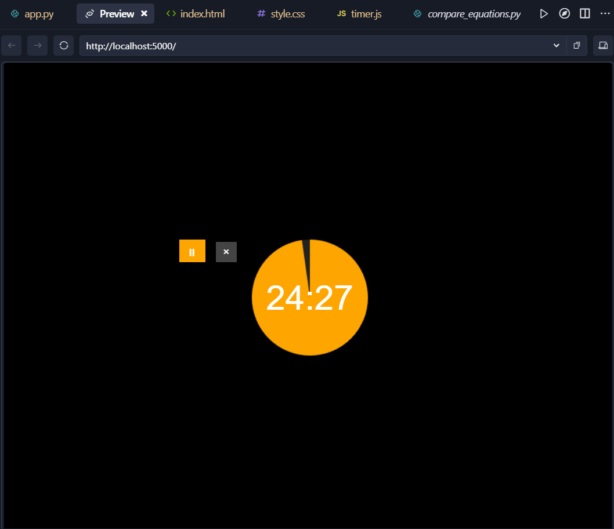

# Author's Note
The Standby mode in the iPhone is so great when it comes to the pomodoro timer. However, it needs to be in charger all the time... so, I made this app! 

# Modern Timer App

A sleek and minimalist timer application built with Python and Tkinter. Features a beautiful circular progress indicator, keyboard input for time entry, and a clean dark interface. Perfect for tracking work sessions, cooking, or any timed activities.

## Preview


## Features
- Elegant circular progress animation
- Keyboard time input
- Play/Pause functionality
- Resizable window
- Dark mode interface
- Web-based interface
- Responsive design

## Project Structure

```
Timer/
├── static/
│   ├── css/
│   │   └── style.css
│   └── js/
│       └── timer.js
├── templates/
│   └── index.html
└── app.py

```
## Installation

1. Ensure you have Python installed on your system
2. No additional dependencies required (uses built-in Tkinter)

## Usage

1. Run the application:
```python
python timer.py
```
1.2. Enter the desired time in minutes using the keyboard

2. ### Web Application
Run the web version:
```python
python app.py
```
## Components
### Desktop App (timer.py)
- Standalone desktop application using Tkinter
- Native window controls
- System-level integration
### Web App (app.py)
- Flask-based web server
- Browser-accessible interface
- Mobile-responsive design
### Static Files
- CSS: Styling and animations
- JavaScript: Timer logic and UI interactions
### Templates
- HTML: Web interface structure